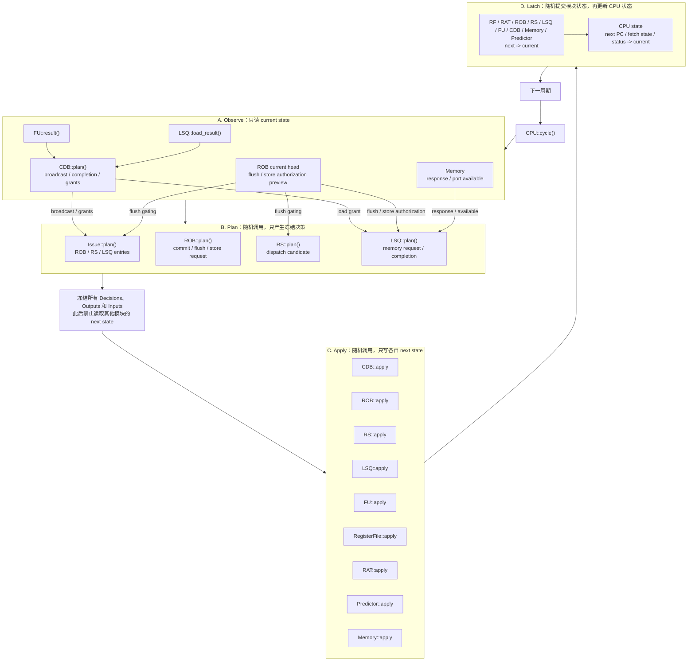
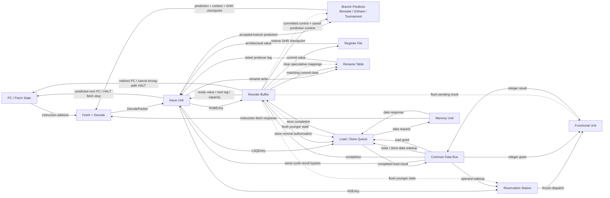

# RISC-V Tomasulo CPU Simulator

本项目是一个使用 C++17 编写的 RV32I CPU 模拟器，以 Tomasulo 算法为基础模拟指令的乱序执行。模拟器从标准输入读取十六进制内存镜像，执行程序后将 `a0` 寄存器的低 8 位作为结果输出。

更完整的课程要求与数据格式说明请参阅 [`doc/README.md`](doc/README.md)。

## 实现思路

模拟器将 CPU 拆分为寄存器堆、寄存器重命名表、保留站、重排序缓冲区（ROB）、Load/Store Queue、功能单元、公共数据总线（CDB）和分支预测器等模块。

指令按照取指、发射、执行、广播和提交的流程运行。可以在操作数就绪后乱序执行，但取指和提交仍保持顺序。ROB 保证程序状态按顺序更新；发生分支预测错误时，模拟器会清除错误路径上的年轻指令，并从正确地址重新取指。

各时序模块采用 `current -> plan -> apply -> next -> latch` 的状态更新方式。CPU
先观察 current state，再随机调用各模块的 Plan；所有输出和输入冻结后随机执行
Apply，最后以随机顺序 Latch，从而避免 C++ 调用顺序成为隐藏的硬件依赖。

条件分支默认使用 Tournament Predictor：局部侧由 LHT/Local PHT 组成，全局侧
使用带 10-bit 投机 GHR 的 GShare，并通过 Chooser 选择预测结果。Bimodal 和
GShare 模式仍可单独运行以进行对比。

## 信息传递与调用关系思维导图

### 单周期调用关系



### 模块信息传递关系



图中的实线表示本周期冻结的数据或控制信号，虚线表示错误预测恢复。CDB、ROB、
RS、LSQ 同时需要产生本周期输出并更新 next state，因此具有独立的 `plan()` 和
`apply()`；Issue 是无状态组合逻辑，只有 `plan()`；其余状态模块通过只读接口暴露
current output，并在 `apply()` 中吸收冻结输入。

## 构建与运行

使用 Makefile 构建：

```bash
make
```

运行一个测试程序：

```bash
./code < data/sample/sample.data
```

默认使用 Tournament 分支预测器，由 LHT/LPHT 局部预测器、GShare 全局预测器和
Chooser 组成。原始 256 项 bimodal 和基础 GShare 均保留用于 A/B 对比：

```bash
./code --predictor=bimodal < data/sample/sample.data
./code --predictor=gshare < data/sample/sample.data
./code --predictor=tournament < data/sample/sample.data
```

程序结果输出到 `stdout`，周期数、提交指令数和分支预测统计输出到 `stderr`。

运行测试：

```bash
make test
```

也可以分别执行 `make test-unit` 和 `make test-data`。

## 项目结构

```text
include/
├── common/      基础类型、配置和通用数据结构
├── isa/         RV32I 指令定义及译码接口
├── memory/      内存镜像与内存单元接口
├── reference/   顺序执行解释器接口
└── tomasulo/    CPU、ROB、保留站、LSQ、CDB 和分支预测器等接口

src/
├── main.cpp     模拟器程序入口
├── isa/         RV32I 指令译码实现
├── memory/      内存镜像加载与访存实现
├── reference/   顺序执行解释器实现
└── tomasulo/    Tomasulo CPU 及各硬件模块实现
```

## 分支预测准确率

以下数据分别由 bimodal、GShare 和默认的 Tournament 预测器运行 `data/` 下全部
`.data` 测试得到。准确率按“正确预测数 / 条件分支数”计算；没有条件分支的测试
记为 N/A。

| 预测器 | 正确预测数 | 误预测数 | 总准确率 | 相对 Bimodal |
| --- | ---: | ---: | ---: | ---: |
| Bimodal | 33,869,453 | 7,172,371 | 82.52% | 基线 |
| GShare | 34,569,122 | 6,472,702 | 84.23% | +1.70 个百分点 |
| **Tournament** | **35,442,112** | **5,599,712** | **86.36%** | **+3.83 个百分点** |

Tournament 相比 GShare 又减少了 **872,990 次**误预测，准确率提升
**2.13 个百分点**；相比原始 bimodal 共减少 **1,572,659 次**误预测。

| 测试点 | 分支数 | Bimodal 正确数 | Bimodal 准确率 | GShare 正确数 | GShare 准确率 | Tournament 正确数 | Tournament 准确率 |
| --- | ---: | ---: | ---: | ---: | ---: | ---: | ---: |
| sample | 0 | 0 | N/A | 0 | N/A | 0 | N/A |
| array_test1 | 22 | 12 | 54.55% | 12 | 54.55% | 11 | 50.00% |
| array_test2 | 26 | 15 | 57.69% | 13 | 50.00% | 15 | 57.69% |
| basicopt1 | 155,139 | 127,840 | 82.40% | 152,391 | 98.23% | 154,238 | 99.42% |
| bulgarian | 71,493 | 67,528 | 94.45% | 67,612 | 94.57% | 68,382 | 95.65% |
| expr | 111 | 94 | 84.68% | 65 | 58.56% | 83 | 74.77% |
| gcd | 120 | 81 | 67.50% | 80 | 66.67% | 72 | 60.00% |
| hanoi | 17,457 | 10,667 | 61.10% | 16,390 | 93.89% | 17,163 | 98.32% |
| lvalue2 | 6 | 4 | 66.67% | 4 | 66.67% | 3 | 50.00% |
| magic | 67,869 | 53,220 | 78.42% | 56,988 | 83.97% | 60,276 | 88.81% |
| manyarguments | 10 | 6 | 60.00% | 8 | 80.00% | 8 | 80.00% |
| multiarray | 162 | 135 | 83.33% | 98 | 60.49% | 119 | 73.46% |
| naive | 0 | 0 | N/A | 0 | N/A | 0 | N/A |
| pi | 39,956,380 | 32,925,342 | 82.40% | 33,556,945 | 83.98% | 34,400,333 | 86.09% |
| qsort | 200,045 | 174,888 | 87.42% | 192,414 | 96.19% | 196,268 | 98.11% |
| queens | 77,116 | 56,588 | 73.38% | 63,558 | 82.42% | 64,238 | 83.30% |
| statement_test | 202 | 122 | 60.40% | 122 | 60.40% | 119 | 58.91% |
| superloop | 435,027 | 408,156 | 93.82% | 411,425 | 94.57% | 429,289 | 98.68% |
| tak | 60,639 | 44,755 | 73.81% | 50,997 | 84.10% | 51,495 | 84.92% |
| **总计** | **41,041,824** | **33,869,453** | **82.52%** | **34,569,122** | **84.23%** | **35,442,112** | **86.36%** |
